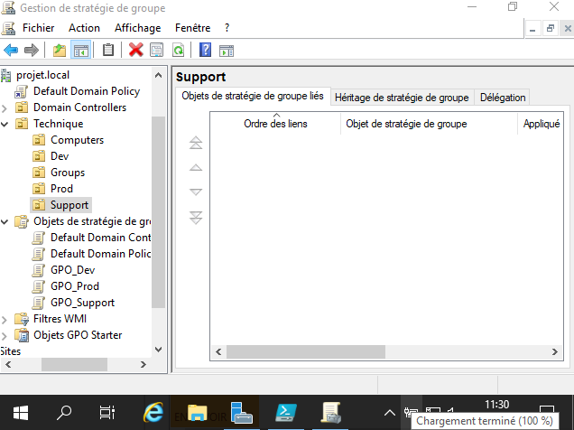

# Scripting des GPOs
Nous utilisons un script pour faciliter l'application des GPOs aux groupes de Dev, Prod et Support. Le script powershell est le suivant:
```ps1
# Créer des GPO pour chaque groupe
New-GPO -Name "GPO_Dev"
New-GPO -Name "GPO_Support"
New-GPO -Name "GPO_Prod"
```
- Nous créons nos GPOs pour chacun des groupes avec l'applet **New-GPO**
## GPO_Dev - Restrictions pour l'équipe de développement 

```ps1
Set-GPRegistryValue -Name "GPO_Dev" -Key "HKEY_CURRENT_USER\Software\Policies\Microsoft\Windows\AppLocker" -ValueName "Enable" -Type DWord -Value 1
Set-GPRegistryValue -Name "GPO_Dev" -Key "HKEY_CURRENT_USER\Software\Policies\Microsoft\Windows\AppLocker" -ValueName "Enforce" -Type DWord -Value 1
```
- Active et applique les restrictions d'AppLocker pour contrôler les applications et les scripts exécutés par les membres de l'équipe de développement.

## GPO_Support - Restrictions pour l'équipe de support 
```ps1
Set-GPRegistryValue -Name "GPO_Support" -Key "HKEY_CURRENT_USER\Software\Policies\Microsoft\Windows\RemoteAssistance" -ValueName "AllowRA" -Type DWord -Value 1
Set-GPRegistryValue -Name "GPO_Support" -Key "HKEY_LOCAL_MACHINE\Software\Policies\Microsoft\Windows\Installer" -ValueName "DisableMSI" -Type DWord -Value 1
```
- Autorise l'assistance à distance (RA) pour les membres de l'équipe de support afin qu'ils puissent se connecter à distance aux ordinateurs des clients pour résoudre les problèmes et les incidents.
- Configure la stratégie "Software Installation" pour interdire l'installation de logiciels en définissant la valeur "DisableMSI" à 1 dans le registre.

## GPO_Prod - Restrictions pour l'équipe de production 
```ps1
Set-GPRegistryValue -Name "GPO_Prod" -Key "HKEY_CURRENT_USER\Software\Policies\Microsoft\Windows\PowerShell" -ValueName "EnableScripts" -Type DWord -Value 1
Set-GPRegistryValue -Name "GPO_Prod" -Key "HKEY_CURRENT_USER\Software\Policies\Microsoft\Windows\PowerShell" -ValueName "ExecutionPolicy" -Type String -Value "RemoteSigned"
```
- Autorise l'exécution de scripts PowerShell et définit la politique d'exécution à "RemoteSigned" pour garantir que seuls les scripts signés à distance sont exécutés dans l'environnement de production.
```ps1
Set-GPLink -Name "GPO Dev" -Target "OU=Dev,OU=Technique,DC=projet,DC=local"
Set-GPLink -Name "GPO Support" -Target "OU=Support,OU=Technique,DC=projet,DC=local"
Set-GPLink -Name "GPO Prod" -Target "OU=Prod,OU=Technique,DC=projet,DC=local"
```
- Enfin, chaque GPO est liée à l'unité d'organisation correspondante en utilisant l'applet **Set-GPLink**. 

## Vérification dans l'interface de gestion GPO
